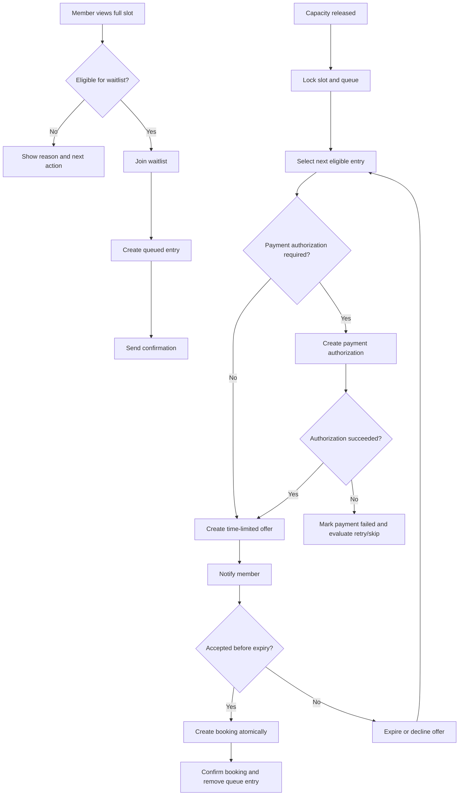

# Product Planning Sample — Multi-Tenant Club Booking Waitlist

> Public hypothetical exercise. This document is not based on Courtnexa confidential information and does not claim prior work for Courtnexa or any sports-club operator.

## 1. Problem statement

Sports clubs lose revenue and create member frustration when high-demand court slots are fully booked, cancellations occur late, and replacement demand is handled through phone calls, chat groups, or staff memory.

The product should support an automated waitlist that:

- lets eligible members join a queue for a full booking slot;
- offers released capacity to the next eligible member;
- enforces a time-limited acceptance window;
- avoids double booking and race conditions;
- respects club, membership, payment, age, and access rules;
- gives operators an auditable view of every offer and outcome.

## 2. Planning assumptions

These assumptions would be validated before implementation:

- the platform is multi-tenant and each club controls its own policies;
- a booking slot has a fixed capacity and may contain one or more courts/resources;
- users can belong to multiple clubs with different membership entitlements;
- booking creation and cancellation already exist;
- payment may be required immediately, later, or not at all depending on club policy;
- notifications can be delivered by email, push, SMS, or in-app inbox;
- the system has an authoritative server-side clock;
- all queue transitions are performed by backend services, not trusted client state.

## 3. Goals and non-goals

### Goals

1. Recover cancelled capacity without requiring staff intervention.
2. Reduce member effort to monitor high-demand times.
3. Make allocation rules predictable and auditable.
4. Prevent overselling, duplicate offers, and stale acceptance links.
5. Support club-specific rules without forking the workflow.
6. Produce operational metrics for policy tuning.

### Non-goals for v1

- auction or surge pricing;
- social matchmaking between unrelated players;
- cross-club pooled inventory;
- resale or transfer of accepted reservations;
- advanced ranking based on loyalty or spend;
- staff override of payment-provider settlement rules;
- machine-learning demand prediction.

## 4. Primary users

### Member

Needs to join a queue, understand position and rules, receive an offer, accept or decline, and see the resulting booking.

### Club operator

Needs to configure policy, inspect queue state, resolve exceptions, and review an audit log.

### Support or finance user

Needs to understand payment outcomes, refunds, failed charges, and disputed allocations without editing queue order.

### System administrator

Needs tenant-safe observability, retry controls, and incident diagnostics without accessing unnecessary customer data.

## 5. Core policy model

Each club may configure:

- whether waitlists are enabled by location, resource type, or event type;
- maximum queue length;
- maximum active waitlist entries per member;
- whether queue order is first-come-first-served or staff-prioritized;
- minimum membership tier;
- age or guardian restrictions;
- time before booking when waitlist intake closes;
- offer acceptance window;
- whether payment authorization is required before acceptance;
- penalty for repeated offer expiry or no-show;
- notification channels and fallback order;
- whether staff may manually skip an ineligible member;
- cancellation and refund policy inherited by an accepted waitlist booking.

Policy changes apply prospectively unless an operator explicitly chooses to recalculate an existing queue and confirms the impact.

## 6. Main user flow



## 7. State model

A waitlist entry has one active state at a time:

- `QUEUED`
- `OFFER_PENDING`
- `ACCEPTED`
- `DECLINED`
- `EXPIRED`
- `PAYMENT_FAILED`
- `INELIGIBLE`
- `REMOVED_BY_MEMBER`
- `REMOVED_BY_OPERATOR`
- `CANCELLED_SLOT`

Allowed transitions are server-controlled and recorded with timestamp, actor, reason, and correlation ID.

Example transition rules:

- `QUEUED -> OFFER_PENDING` only after capacity is available and the entry is still eligible;
- `OFFER_PENDING -> ACCEPTED` only when the offer token is valid, not expired, and capacity remains reserved;
- `OFFER_PENDING -> EXPIRED` when the acceptance deadline passes;
- any active state -> `CANCELLED_SLOT` when the underlying event is cancelled;
- `ACCEPTED` is terminal for the waitlist entry and creates a separate booking record.

## 8. Data model sketch

### WaitlistEntry

- `id`
- `tenant_id`
- `club_id`
- `slot_id`
- `member_id`
- `membership_id`
- `state`
- `priority_rank`
- `joined_at`
- `offer_id`
- `eligibility_snapshot_version`
- `created_by`
- `removed_reason`
- `version`

### WaitlistOffer

- `id`
- `waitlist_entry_id`
- `slot_id`
- `reserved_capacity`
- `issued_at`
- `expires_at`
- `accepted_at`
- `declined_at`
- `notification_status`
- `payment_authorization_id`
- `token_hash`
- `version`

### WaitlistPolicy

- `tenant_id`
- `club_id`
- `scope_type`
- `scope_id`
- `enabled`
- `queue_limit`
- `acceptance_window_seconds`
- `eligibility_rule_version`
- `payment_rule`
- `notification_rule`
- `effective_at`

Every query and mutation must be tenant-scoped. Composite uniqueness should prevent one member from holding duplicate active entries for the same slot.

## 9. API sketch

### Join waitlist

`POST /clubs/{clubId}/slots/{slotId}/waitlist`

Request:

```json
{
  "membershipId": "mem_123",
  "notificationPreference": ["push", "email"]
}
```

Possible results:

- `201` queued;
- `409` duplicate active entry;
- `422` not eligible with machine-readable reason;
- `403` tenant or membership boundary violation;
- `410` waitlist intake closed.

### Accept offer

`POST /waitlist-offers/{offerId}/accept`

Requirements:

- idempotency key;
- authenticated member matches the offer;
- token and session are valid;
- offer is not expired;
- slot capacity reservation is still valid;
- booking creation and offer acceptance occur in one transaction or equivalent atomic workflow.

### Operator queue view

`GET /clubs/{clubId}/slots/{slotId}/waitlist`

Returns queue entries, eligibility status, active offer, timestamps, and audit-safe reasons. Sensitive payment details are excluded.

## 10. Edge cases

1. Two cancellations occur at nearly the same time.
2. Member accepts on two devices simultaneously.
3. Offer expires while payment authorization is pending.
4. Notification fails but the offer remains valid.
5. Member loses eligibility after joining but before an offer.
6. Club changes the acceptance window while an offer is active.
7. Slot time changes after members have queued.
8. Event is cancelled after an offer is issued.
9. Operator removes a member while an acceptance request is in flight.
10. Payment succeeds but booking creation times out.
11. Member is already booked for an overlapping slot.
12. Minor account requires guardian approval.
13. Club timezone changes or daylight-saving transition occurs.
14. A staff override attempts to bypass tenant or membership rules.
15. Queue processing job retries after partial completion.

Each edge case needs an explicit expected state, retry rule, and support-visible audit event.

## 11. Ticket breakdown

### EPIC WL-1 — Policy and eligibility foundation

**WL-101: Define tenant-scoped waitlist policy schema**

Acceptance criteria:

- policy can be enabled per club and resource scope;
- default values are explicit and versioned;
- unauthorized tenants cannot read or modify another tenant's policy;
- policy changes produce an audit event;
- migration includes rollback notes.

**WL-102: Implement eligibility evaluation service**

Acceptance criteria:

- returns eligible/ineligible plus machine-readable reasons;
- evaluates membership status, tier, age, overlap, queue limits, and intake deadline;
- evaluation is deterministic for a supplied policy version and timestamp;
- unit tests cover each rejection reason;
- service does not mutate queue state.

### EPIC WL-2 — Member queue operations

**WL-201: Join a full slot waitlist**

Acceptance criteria:

- eligible member can create one active entry;
- duplicate requests are idempotent or return a documented conflict;
- queue position is calculated without exposing other members' identities;
- confirmation notification is queued;
- audit event records actor, slot, policy version, and result.

**WL-202: Leave waitlist**

Acceptance criteria:

- queued member can remove their own entry;
- member cannot remove another member's entry;
- removing an entry with an active offer releases reserved capacity safely;
- repeated removal is idempotent;
- operator and member actions are distinguishable in the audit log.

### EPIC WL-3 — Offer orchestration

**WL-301: Reserve released capacity and create next offer**

Acceptance criteria:

- only one worker can reserve the same capacity unit;
- next eligible queue entry is selected according to policy;
- ineligible entries are skipped with recorded reason;
- offer expiry uses server time and club timezone only for display;
- retrying the job cannot create duplicate active offers.

**WL-302: Accept an offer atomically**

Acceptance criteria:

- acceptance is rejected after expiry;
- acceptance is idempotent;
- payment and booking state are reconciled on partial failure;
- capacity cannot exceed configured limit;
- successful acceptance creates a booking and terminal waitlist state;
- focused concurrency tests cover simultaneous accepts.

**WL-303: Expire or decline an offer and advance queue**

Acceptance criteria:

- expiry is processed once;
- reserved capacity is released;
- next eligible member is evaluated;
- notification retries do not extend the acceptance window unless policy explicitly allows it;
- support users can see the transition reason.

### EPIC WL-4 — Operator controls and observability

**WL-401: Operator queue console**

Acceptance criteria:

- authorized operator sees queue order, state, and timestamps;
- personal data is minimized;
- operator can remove or skip an entry only with a reason;
- manual actions do not bypass payment or tenant boundaries;
- changes appear in an immutable audit view.

**WL-402: Waitlist metrics and alerts**

Acceptance criteria:

- metrics include join rate, offer rate, acceptance rate, expiry rate, fill recovery, and median time-to-offer;
- metrics are tenant-scoped;
- alerts exist for stuck offers, repeated job failures, and payment/booking reconciliation failures;
- dashboards do not expose one tenant's data to another.

## 12. Definition of ready

A ticket is ready for development when:

- business objective and user are named;
- policy decisions are closed or explicitly flagged;
- data ownership and tenant boundary are stated;
- success and failure paths are documented;
- acceptance criteria are observable;
- dependencies and migration impact are known;
- privacy, payment, age, or regulatory questions have owners;
- design has enough detail for implementation without guessing core behavior.

## 13. Definition of done

- acceptance criteria pass;
- tenant-isolation tests pass;
- concurrency and idempotency tests cover critical transitions;
- migration and rollback notes exist;
- audit events are emitted for all state changes;
- monitoring and failure alerts are in place;
- operator and member documentation is updated;
- known limitations are recorded;
- product owner accepts the workflow using a controlled test scenario.

## 14. Metrics

Primary metrics:

- percentage of released capacity recovered through the waitlist;
- offer acceptance rate;
- median time from capacity release to confirmed replacement booking;
- booking conflict rate;
- payment/booking reconciliation failure rate;
- staff interventions per 100 waitlist offers.

Guardrail metrics:

- member complaints about unfair allocation;
- notification failure rate;
- duplicate booking incidents;
- cross-tenant access incidents;
- no-show rate among waitlist-converted bookings;
- refund and chargeback rate.

## 15. Rollout plan

### Phase 0 — decision closure

Validate policy decisions, tenant model, booking transaction boundaries, payment behavior, notification guarantees, and support ownership.

### Phase 1 — internal test club

Enable one club with synthetic members and no live payments. Test concurrency, expiry, operator actions, and failure recovery.

### Phase 2 — limited live pilot

Enable one club, one resource type, capped queue length, and one notification channel. Monitor every offer manually.

### Phase 3 — policy expansion

Add multiple notification channels, payment authorization, age restrictions, and additional resource types after pilot metrics are stable.

### Rollback

Disable new joins, allow active offers to complete or expire, preserve audit records, and revert released capacity to operator-managed allocation.

## 16. Open questions before implementation

1. Is capacity represented as a single slot, court count, seat count, or participant roster?
2. Which booking and payment operations are already atomic?
3. Can one user act for dependents or teams?
4. Which regulatory rules apply to minors and marketing notifications?
5. Are club policies inherited from organizations or configured independently?
6. Does an accepted offer create an immediate charge, authorization, invoice, or unpaid reservation?
7. What is the required behavior when payment succeeds but booking creation fails?
8. Which team owns customer support and manual reconciliation?
9. What audit retention period is required?
10. What level of real-time position visibility is acceptable without creating gaming behavior?

## 17. Planning conclusion

The waitlist should be treated as a stateful allocation workflow, not a notification feature. The riskiest implementation areas are capacity reservation, idempotent acceptance, payment/booking reconciliation, eligibility changes, and tenant isolation. A useful v1 is narrow: one queue policy, one resource type, one notification channel, observable acceptance criteria, and strong auditability before broader configuration is added.
